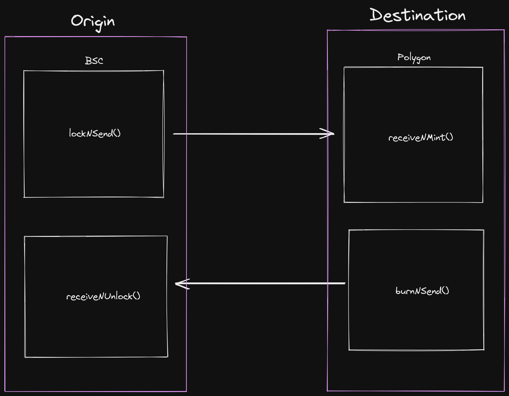

# FuschiaMercuryCorgi

## Custom token bridge using Connext SDK



## Description

This is a *ready-to-deploy* implementation of a custom token bridge, using [Connext](https://docs.connext.network/) technology to perform an `xCall`.
It can be deployed on every chain supported by Connext (Amarok upgrade) with any ERC20 token.

This is **experimental** and **not** audited.

Currently it has 2 modes:

- **With mint**: one or both sides of the bridge are an ERC20 token implementation and mints balance directly to the receiver account. (Liquidity is infinite by default)
- **With liquidity**: one or both sides of the bridge work with liquidity supplied by the owner of the bridge. Liquidity supply is capped by current liquidity and it's not infinite. Contract owner can decide to extract all liquidity at all time.

## Basic example usage:

Alice want to send 10 tokens from BSC to Polygon, so she calls to `lockNSend()` (specifying *amount*, *receiver* and *relayer fee*) in BSC. 
Then, Connext will take the data and send a transaction in Polygon calling `receiveNUnlock()`. That will mint or send the tokens to Alice (or selected receiver).

## Instructions

To deploy a side in a testnet you can use any of the scripts in the folder or create one:

``` 
npx hardhat run scripts/*scriptName*.js --network *networkName*
```

Or you can execute *deploy* task with required parameters:

``` 
npx hardhat deploy *here write required parms* --network *networkName*
```

Once both sides deployed you need to call *init* task (on both sides):

```
npx hardhat init *here write required parms* --network *networkName*
```

Now you can start bridging. Call *bridge* task:

```
npx hardhat bridge *here write required parms* --network *networkName*
```